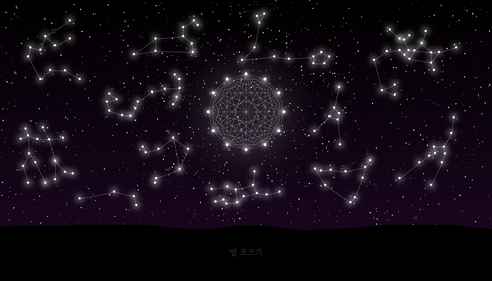

# Moonlight 🌙

**Moonlight**는 매일 할 일을 완료하여 별들을 만들고, 별자리를 완성하며 밤하늘을 채워나가는 투두 리스트 웹사이트입니다. 사용자는 할 일을 완료하면서 시각적으로 성취감을 얻고, 12개의 별자리를 모두 완성하면 달을 띄울 수 있습니다.

## 배포 링크
[Moonlight 바로 가기](https://sxunxin.github.io/Moonlight)

## 기술 스택
- HTML
- CSS
- JavaScript

## 주요 기능

### 1. 투두리스트 관리
- **별 모으기** 버튼을 클릭하여 To-Do 리스트를 띄울 수 있습니다.
- 카테고리를 추가 및 삭제할 수 있습니다.
- 각 카테고리별로 개별 To-Do를 생성할 수 있습니다.
- 각 To-Do는 수정, 루틴 설정, 삭제가 가능합니다.

### 2. 별 만들기 시스템
- 하나라도 완료된 To-Do가 있으면 **별 만들기** 버튼이 활성화됩니다.
- **별 만들기** 버튼을 클릭하면 완료된 To-Do 수만큼 별이 밤하늘에 추가됩니다.
- 완료된 To-Do가 5개 이상이면, 1개는 큰 별이 되어 별자리의 일부로 추가됩니다.
- **별 만들기** 기능은 하루에 한 번만 사용할 수 있습니다.

### 3. 개발자 모드
기능 테스트를 쉽게 할 수 있도록 개발자 모드를 제공합니다.  
개발자 모드에서는 별 만들기 제한 해제, 날씨 표시, 자유로운 별 생성 등의 단축키를 제공하여 테스트를 편리하게 합니다.

### 4. 목표
- 12개의 별자리를 모두 모으면, 화면 중앙에 **달**이 나타납니다. 각 별자리는 사용자가 할 일을 완료하며 차례대로 완성되어, 밤하늘을 채워나가는 재미있는 경험을 제공합니다. 이 과정을 통해 사용자가 매일 To-Do를 꾸준히 관리하며 성취감을 느끼고 지속적으로 할 일을 이어갈 수 있도록 돕습니다.

## 프로젝트 목적
이 프로젝트는 웹 개발을 처음 공부한 후 실전 경험을 쌓기 위한 목적에서 시작되었습니다. HTML, CSS, JavaScript를 활용하여 웹사이트의 기본 구조와 기능을 구현하며, 실습을 통해 웹 개발 기술을 익히고자 했습니다. 또한, 사용자가 할 일을 완료하며 시각적 성취를 얻을 수 있는 시스템을 제공하여, 꾸준히 To-Do를 이어가는 동기를 부여하고자 했습니다.
